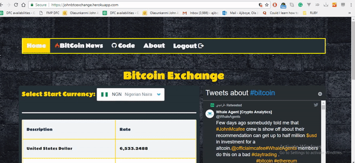

# Btex-Codeafric

BitcoinExchange Angular app to consume API from [CoinDesk](https://www.coindesk.com/api/).
The App is deployed on [Heroku](https://john-btex.herokuapp.com/) ,check out the working [Demo](https://john-btex.herokuapp.com/).

If you have trouble with signin/register.The server might be down. You can view the demo without the backend  [here](https://johnbtcexchange.herokuapp.com/index.html#)


To run locally use:

```git clone https://github.com/OlaJohn-Ajiboye/btex-codeafric.git``` 
*It can then be served on a server of your choice*.




